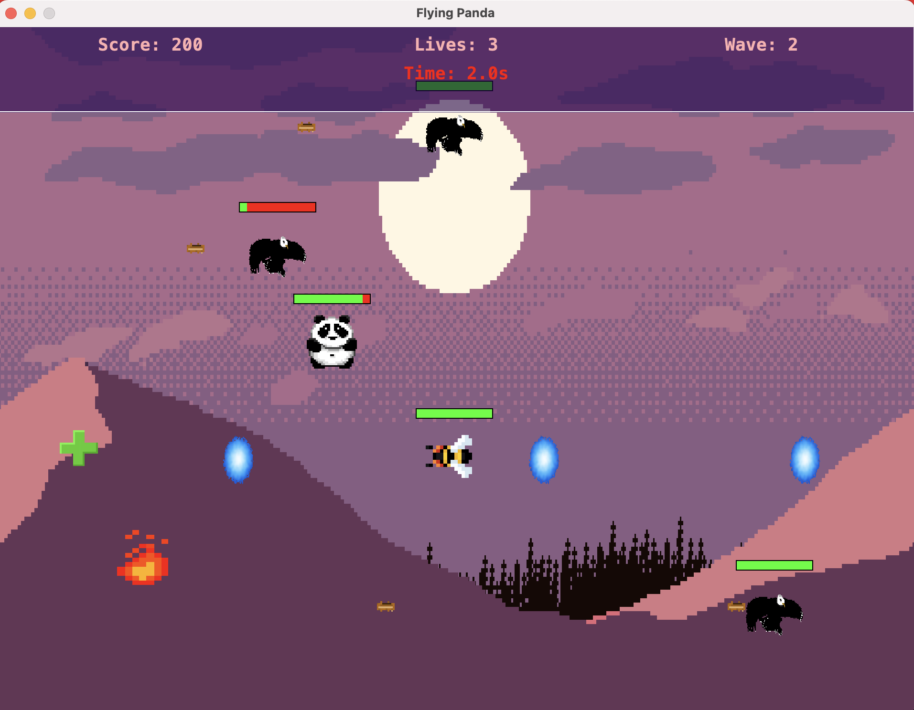

# Flying Panda 🐼

A 2D tile based, side scrolling shooter game for 42 Warsaw game contest :)

## Quick overview ⚡️
The game is built in pure Java using Swing. All the Sprites are publicly available.
No animal was harmed during the development.

## Features 🤓
- Wave based gameplay
- Multiple enemies
- Collectibles
- Health and Lives System
- Scoring System with external Leaderboard API
- SFX & Music

## Build 🧱

Java 17+ is required to build this project.

### Run with javac
#### Linux / MacOS 🐧
```bash
cd linux
make
./run.sh
```
#### Windows 🪟
```shell
powershell -ExecutionPolicy Bypass -File .\build.ps1
java --enable-preview -jar .\flyingPanda.jar
```

### Build and run with Maven Ⓜ️
```bash
mvn clean install
java -cp target/flyingPanda-1.0-SNAPSHOT.jar com.FlyingPanda.main.Main
```

## Preview 🖼️


## Notes 🗒️
- The leaderboard system will be down eventually as I'm not going to pay for VPS lol
